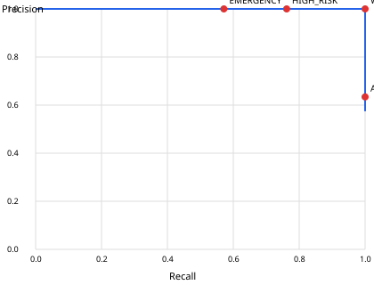

# 평가 리포트 (2026-10-01T18:51:18+00:00)

- 데이터: synthetic / 시나리오 11종 × seed 3 = 33회, GT 사건 21건, 카메라-시간 0.4617h, 노이즈 hard
- 정책: `configs/policy.default.yaml` (provenance: hypothesis)
- AP(strict) 1.0, AP(lenient: 유형 무관) 1.0

## 운영점(위험 단계 경계)별 사건 단위 성능 — strict(유형 일치)

| 단계 | θ | Precision | Recall | F1 | FNR | FP | FP/cam-h | 평균 지연(s) | P90 지연(s) |
|---|---|---|---|---|---|---|---|---|---|
| ATTENTION | 0.3 | 0.6341 | 1.0 | 0.7761 | 0.0 | 15 | 32.491 | 9.86 | 58.3 |
| WARNING | 0.5 | 1.0 | 1.0 | 1.0 | 0.0 | 0 | 0.0 | 12.1 | 69.9 |
| HIGH_RISK | 0.7 | 1.0 | 0.7619 | 0.8649 | 0.2381 | 0 | 0.0 | 18.21 | 81.15 |
| EMERGENCY | 0.85 | 1.0 | 0.5714 | 0.7273 | 0.4286 | 0 | 0.0 | 7.87 | 20.41 |

## 유형별 (WARNING 기준)

| 유형 | GT | P | R | F1 | FP | 평균 지연(s) |
|---|---|---|---|---|---|---|
| 폭행/싸움 | 3 | 1.0 | 1.0 | 1.0 | 0 | 2.5 |
| 흉기·위험물 위협 | 3 | 1.0 | 1.0 | 1.0 | 0 | 3.37 |
| 추격 | 3 | 1.0 | 1.0 | 1.0 | 0 | 1.7 |
| 쓰러짐 | 6 | 1.0 | 1.0 | 1.0 | 0 | 2.08 |
| 침입 | 3 | 1.0 | 1.0 | 1.0 | 0 | 3.03 |
| 비정상 배회 | 3 | 1.0 | 1.0 | 1.0 | 0 | 69.97 |

## 하드 네거티브(정상-유사 상황) 최고 점수

- bat_sports: [0.312, 0.312, 0.312]
- greeting_hug: [0.0, 0.0, 0.0]
- jogging_pair: [0.271, 0.293, 0.271]
- kitchen_knife_carry: [0.453, 0.482, 0.352]
- normal_walkers: [0.0, 0.0, 0.0]
- phone_users: [0.267, 0.432, 0.409]

## WARNING 기준 오탐 0건 / 미탐 0건

## 주의

- 합성(시뮬레이션) 데이터 결과입니다. 실제 CCTV 성능을 의미하지 않습니다.
- 인식(탐지·추적·자세) 오류는 NoiseModel 가정값으로 모사되었습니다. 실제 모델 오류 분포로 교체 필요.
- 카메라-시간이 매우 짧아 FP/cam-h는 참고용입니다. 실제 장시간 정상 영상으로 측정해야 합니다.
